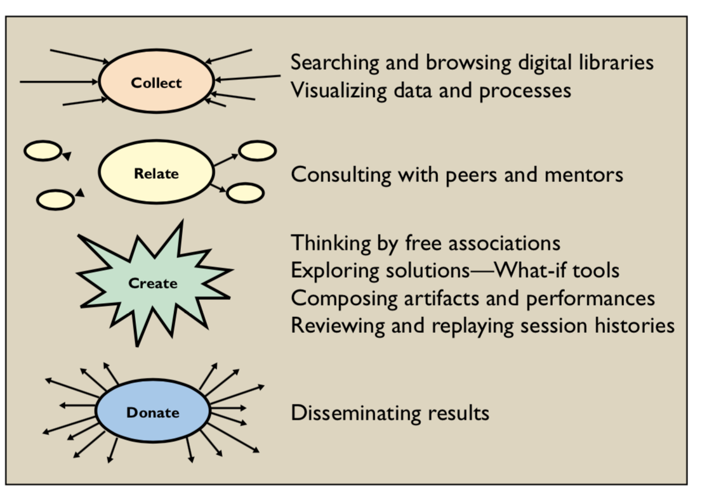

https://docs.google.com/spreadsheets/d/1rRgy6ttw4abetIv3l1sKLVgx2EWsFDqcfVogNSMskn0/

- overall info: <https://eecs.berkeley.edu/resources/grads/phd/prelims/breadth>
- exam prep: <https://eecs.berkeley.edu/resources/grads/phd/prelims/exam-prep>

6/11

- Olsen, Building Interactive Systems, Ch 1 + 3:Architectures of Interactive Systems + Event Handling
- Shneiderman, Plaisant, Coen, Jacobs. Designing the User Interface. Chapter 9, Collaboration and Social Media Participation.
- User Technology: From Pointing to Pondering, Stuart K. Card and Thomas P. Moran, ACM Conference on the history of personal workstations, 1986
- At Home with Ubiquitous Computing: Seven Challenges, Edwards, W. K. and Grinter, R. E. In Proceeding of Ubicomp 2001, p. 256-272.

6/18

- A Morphological analysis of the design space of input devices, Stuart K. Card, ACM Transactions on Information Systems, 1992
- Interacting with paper on the DigitalDesk. Pierre Wellner, Communications of the ACM 36, 7 (Jul. 1993)
- Low-cost multi-touch sensing through frustrated total internal reflection. Jefferson Han. In Proceedings of UIST 2005
- Beyond being there, Hollan, J. and Stornetta, S, Proceedings of CHI 1992

6/25

- Groupware and Social Dynamics: Eight Challenges for Developers, Jonathan Grudin, (CACM), 1994.
- Designing games with a purpose. von Ahn, L. and Dabbish, L., CACM, 2008.
- Practical Guide to Controlled Experiments on the Web, Ron Kohavi, Randal M. Henne, Dan Sommerfield, KDD, 2007.
- Evaluating User Interface Systems Research. D. R. Olsen, UIST 2007

7/2

- How Bodies Matter
- Getting the Right Design and the Design Right: Testing Many Is Better Than One
- Creativity support tools.
- Principles of Mixed-Initiative User Interfaces,

7/9

- Edit wear and read wear. Hill, W. C., Hollan, J. D., Wroblewski, D., and McCandless, T. CHI 1992.
- Past, Present, and Future of User Interface Software Tools, Brad Myers, Scott E. Hudson, Randy Pausch, ACM ToCHI, March 2000.
- The State of the Art in End-User Software Engineering. Andrew J. Ko, et al. ACM Computing Surveys.

7/16

- Example-centric programming: integrating web search into the development environment. Brandt, CHI 2010
- The Design of Search User Interfaces, Marti Hearst, 2010\. Chapter 1 from Search User Interfaces.
- Exploring and Finding Information, Pirolli, Chapter 7 in HCI Models, Theories, and Frameworks.
- Reflective Physical Prototyping through Integrated Design, Test, and Analysis, Hartmann, Klemmer, Bernstein. UIST 2006.

7/23

- J. Zimmerman, et al, 'Research through design as a method for interaction design research in HCI,' in Proceedings of CHI, 2007
- Design Principles for Visual Communication Agrawala, Li, Berthouzoz, CACM 2011
- Soylent: a word processor with a crowd inside - Bernstein et al, UIST 2010

7/30

- Parallel prototyping leads to better design results, more divergence, and increased self-efficacy Dow et al, TOCHI 2010.
- Predicting Tie Strength with Social Media Gilbert and Karahalios, CHI 2009.
- Ishii, H., and Ullmer, B. 'Tangible Bits: Toward Seamless Interfaces between People, Bits and Atoms'. CHI 97.

8/27 PRELIM EXAM

research notes
==============

### 6/11

### User Technology: From Pointing to Pondering

Fitts’ Law: Movement Time = Constant + .1 log2(D/S + .05) sec

Keystroke level model, GOMS: goals, operators, methods, selections

For basic/complex tasks, no difference whether users have mental model

Only changes things when there is an invention-style task performed

ETIT Analysis: internal tasks, external tasks, detect how specific system is 

Two problems: how to represent and manipulate one’s own ideas in system

NoteCards: idea structuring and linking, stacked view of process interplay

Lol… user flying around charts as the vision of the future. Multi-level zoom

Insights into the physical, cognitive, and conceptual levels of HCI intefaces

### Building Interactive Systems

daniel wigdor, book chapter.

event handling techniques

how to tell where in the window touched

primarily focused on the mouse/keyboard combo.

### Collaboration and Social Media Participation

Time/space quadrant, with four types of group-supported work:

1. face-to-face interactions: decision rooms, single display groupware
2. continuous task: same place, different time, large public display
3. remote interactions: different place, same time, video conferencing
4. communication and coordination: different places, difference times

### At Home With Ubiquitous Computing: 7 Challenges

1. the accidentally smart home
  1. People are demoing apps and systems from the ground up
  2. Need to include the mix of heterogeneous protocolors, devices
2. impromptu interoperability
3. no systems administrator
  1. appliance vs. utility model, smart device vs stupid devices
  2. should you configure your devices yourselves
4. designing for domestic use
  1. quiet tech, using text messaging
5. social implications of aware home tech
  1. washing machine, changing expectations
  2. need to be sensitive to root underlying cause
6. reliability
  1. routers vs. printers
  2. impact on acceptance
7. inference in the presence of ambiguity
  1. megan clark, inferring what activities users are doing
  2. ML pushing the boundaries of what is possible

6/18

Three of these papers came out within two years, from 1991-1993.

The other paper, FTIR, was presented as a note (short paper) at UIST 2005.

### A Morphological analysis of the design space of input devices

[https://docs.google.com/presentation/d/1kfNT7s7RmEh85rjmCYFVaBqThtUYbuTO4U9\_drC2US0/](https://docs.google.com/presentation/d/1kfNT7s7RmEh85rjmCYFVaBqThtUYbuTO4U9_drC2US0/edit#slide=id.g21278c8525_0_119)

Stu Card has shifted from his work on MHP into input devices, and Fittz law.

In general, his work has a empirical and objective flavor, which can be dry.

### Interacting with paper on the DigitalDesk

Pierre Wellner, graduating from Cambridge in 1994, published article in CACM.

Working at Xerox PARC at the time, still active in web/FGPA development

### Low-cost multi-touch sensing through frustrated total internal reflection

The big thing here was the ability for multiple points of contact on the surface.

Jeff Han was a grad student at NYU, but dropped out to commericalize his invention.

He went on to become a big supporter of UIST, being one of the top-tier sponsors in 2017.

### Beyond being there

[https://docs.google.com/presentation/d/1za20m4TrLMEwhhjdp7QvVeqFduTUbzSlw5TPBWmtBUE/](https://docs.google.com/presentation/d/1za20m4TrLMEwhhjdp7QvVeqFduTUbzSlw5TPBWmtBUE/edit#slide=id.p)

Jim Hollan published BBT in 92, when CHI was only ten years old.

A time when other papers are pushing for tech to emulate presence, a call for creativity.

One of the most interesting, manifesto pieces in the reading list

### 6/25

### Groupware and Social Dynamics: Eight Challenges for Developers

[https://docs.google.com/presentation/d/1Zi3wTazDBp3GtHgGwnJGkHk\_rBgFaw\_I6RobRoW90IE/](https://docs.google.com/presentation/d/1Zi3wTazDBp3GtHgGwnJGkHk_rBgFaw_I6RobRoW90IE/)

Jonathan Grudin, Professor at UC Irvine at the time of publication, later moved onto MS Research.

He did his phd in cognitive psychology from UCSD, where he studied under Donald Norman.

CACM, 1994\. Netscape was released, the lion king came out, and I was just one year old. 

IS=information systems (large scale corporate technology, top-down approach. mainframes)

previous work has focused on supporting institutional computing efforts (~60s), or later individuals.

The paper stylizes this transition as systems, micro-applications, then to groupware

computing tools become cheaper, more standardized, easier to interface and work together.

primary groupware users are developers of off-the-shelf commerical software.

Acceptance of groupware is a big challenge… facing both social and political factors

Overview of the 8 main problemsx facing groupware developers:

1. disparity in work and benefits
2. Critical mass and prisoner’s dilemma problems
3. disruption of social processes
4. exception handling
5. unobtrusive accessibility
6. difficulty of evaluation
7. failure of intuition
8. the adoption process

Email serves as a solid example which has gotten around a lot of these challenges.

### Designing Games with a purpose

[https://docs.google.com/presentation/d/1JJVtRwwGFIaIZi9qrjZCgP7CsxuScEQNCMv9\_fiXiz4/](https://docs.google.com/presentation/d/1JJVtRwwGFIaIZi9qrjZCgP7CsxuScEQNCMv9_fiXiz4/)

This work was published in the CACM in 2008, internet use is spreading, fb is 4 years old.

Luis von Ahn, CMU professor and founder of duolingo (language learning app).

Laura Dabbish, also is a CMU professor, at the time was just 1 year out (grad 2007).

This work served as a set of guidelines they had gleaned from their experience building out early crowd-sourcing systems.

Data generated as a side-effect of Games With A Purpose (GWAPs) can train AI algorithms and solve computational problems.

Example GWAPS: ESP game (image labeller), peekaboom (locate object within images), fetch (annotate images)

Previous work: interactive machine learning, making work fun, networked individuals accomplishing work (oss)

Templates: output-agreement games, inversion-problem game, input agreement games

Features: timed response, score keeping, player skill scores, high score lists, randomness

### Practical Guide to Controlled Experiments on the Web

Listening to your users, not the Hippo.

One accurate measurement is worth more than a thousand expert opinions — Admiral Grace Hopper

Running a/a tests, adding to the null hypothesis test.

Takeaways: stat definitions, determining the number of users.

### Evaluating User Interface Systems Research

[https://docs.google.com/presentation/d/1l9Pps7D-AEf5\_umRiWlkWQUenDe63lgldsRtvigFoV8](https://docs.google.com/presentation/d/1l9Pps7D-AEf5_umRiWlkWQUenDe63lgldsRtvigFoV8)

“How should we evaluate novel user interface systems so that true progress is being made?”

STU: Situations, Tasks, Users

Evaluation errors:

1. The usability trap: walk up and use, standardized task assumption, scale of testing
2. Fatal flaw fallacy
3. Legacy code.

Metrics for evaluation:

1. importance
2. Not previously solved
3. Generality
4. reduction of solution viscosity: flexibility, leverage, match
5. empowering new design participants
6. power in combination: inductive, simplication, combination
7. Scalability

### 7/2

### How Bodies Matter

paper with bjoern, srk, and leila takayama, chi 2006

*five major themes for working in the tangible world:*

* thinking through doing
  * references other tanglible interaction mechanisms
  * montesorri blocks, illuminating light bench
* performance
  * performance is less polished, encourage participation
  * live performance metaphor for interactive nature
  * being part of creating the shared experience
  * different levels of feedback based on fidelity
* visibility
  * stanford design lab, seeing other people’s work
  * air traffic controller, physically updates shared state
* risk
  * physical action is characterized by risk
  * High level of emotion paired with action
* thick practice
  * instead of designing something to emulate the world, design the interaction in the world.

related work includes the model human processor, characterizing types of human-computer interaction.

### Getting the Right Design and the Design Right: Testing Many Is Better Than One

Bill buxton, CHI 2006 paper. UoT grad student Tohidi is first author 

Study involved HCCS (home climate control system) paper prototypes.

When presented with a variety of designs, it is easier for users to critique

* subjective ratings are less prone to inflation compared to a single design
* usability testing alone is not enough to generate solutions; just identifies problems.

Three hypotheses:

* H1: Participants will rate designs lower when all alternatives are seen, compared to when they see only one.
* H2: Participants exposed to alternative designs will be less pressured to be positive, expressing fewer positive comments than those who only see one.
* H3: Participants who see alternative designs will provide more suggestions for improvement compared to those who only see one.

Two statistic tests:

* Mann-Witney U test.
* Cohen’s Kappa test
* Issues with data selection, filtering, and controls.

### Creativity support tools.

Details from this paper were asked on the prelims from last year.

Ben schniederman, published in the 2002 CACM journal. 

This paper defines four main cycles of the design process.

* collect
* create
* relate
* donate

Two patterns: annotate-consult-revise

### Principles of Mixed-Initiative User Interfaces

Eric Horvitz of Microsoft Research/AI, CHI 99 paper.

So yea, direct manipulation is great, but also super tedious. How to soup up?

Background: at the time, there are two research styles in HCI:

1. taking action on the behalf of the user, intelligent automation
2. Direct manipulation interfaces, allow explicit control of state

Potentially conflicting goals, one hides control and the other makes everything explicit.

This paper ties them together and advocates for mixed-initiative user interfaces

Demonstrate the look-up system, automating meeting scheduling (pictured above).

List 12 critical factors for effective integration into direct manipulation interfaces.

1. list all of these!!!

general idea of all of these principtes: 

* develop a probabilistic model of user intentions and goals
* Take into account the cost vs benefit of
* Details on SVM classifiers for how disabmiguate decisions

Managing uncertainty, optimizing the utility to attention required from the user

Doing things to the interface to make the false positives and benefits less bad.

Lays out some visions of what the future could be w/ much much better AI

### 7/9

### Edit wear and read wear

Submitted to CHI 1992, Jim Hollan, Tim McCandless, Bell Labs.

Measuring and encoding digital wear, guiding professional work

Specifically targeted to the realm of document (like Word) processing

Interesting: an informational physics perspective on interface design.

**System**

Two applications, as referred to in the title. Levels of reading and editing are encoded in the scrollbar.

This technique is called: attribute-mapped scroll bars. Benefit: very conservative screen usage.

Also incorporates the info display with the navigation controls.

It was built as a modified version of the zmacs editor.

able to filter per column based on the category of wear

**Theory**

Scheon is referenced often here, for his theory of professional activity, and reflective conversation.

I also see this in the later work of Hartmann et. al, which considers how bodies matter, tangibly interacting

Problem-setting, action-present, conceptually linking the zone of time to the current action context

Physical wear analogy: no extra work is needed to generate or retrieve it.

**Critique**

Labels are user-defined, may be hard to converge on themes/granularity

Multiple vis-bars in the scroll bar is likely absurd, hard to glean meaningful data 

**Relationships**

Related to DigitalDesk, also one year before that (1993).

Also related to 8 Challenges for groupware, in 1994.

A paper which focuses on bringing the real-world into the digital.

A mock-up of spreadsheet wear is created, document changes over time

Ethical issues: to whom does the collected usage data belong to?

Focuses more on the integration rather than process control, smaller groups

**Questions**

Does this notion of including metrics of other user activity (information scent) extend into the modern day?

 There are rough cousins, like discrete number of macro-social interactions (likes, reposts, citations, etc.)

 But still, they all have some higher level of activity associated with them, so maybe a better metric is page counters. 

### Past, Present, and Future of User Interface Software Tools

ToCHI paper including three HCI CMU super powers, submitted in 2000.

Authors: Brad Myers, Scott Hudson, Randy Pausch, longer: 26 pages total.

Topics: software engineering, models and principles, information interfaces

Provides an overview of good/bad parts of interface tools, lessons learned.

Cieling, floor, path of least resistance. “Dawn of a new era of interfaces”

Current toolkits limited value for smaller screens, recognition-based UIs

Tools are important because they improve how quickly UIs built, iteration speed

* Historical perspective
  * themes in evaluating tools
    * parts of the user interface that are addressed
    * threshold and ceiling, learnability and capability
    * path of least resistance, design for the best
    * Predictability
    * moving targets
  * what worked
    * window managers and toolkits
    * event langauages
    * interactive graphical tools
    * Component systems
    * scripting languages
    * hypertext (markdown?)
    * OOP (self.congratulate())
  * promising approaches which have not caught on
    * UI management systems
    * formal language-based tools
    * constraints
    * Model-based and automatic techniques
  * discussion of themes
* Future prospects and visions
  * computers becoming a commodity
  * ubiquitous computing
    * Varying Input and Output Capabilities
    * Tools to Rapidly Prototype Devices, not Just Software
    * Tools for Coordinating Multiple, Distributed Communicating Devices.
  * recognition-based user interfaces
  * …more
* Operating System Issues
* Conclusions

**Questions**

Is the browser the new canvas, or backdrop of application development?

### The State of the Art in End-User Software Engineering

Authored by many people, FA is Andy Ko, UW professor.

Brad Myers is listed among other people from OSU, MIT, etc.

this one is even longer than before, spanning 44 total pages

definition of programming, the process of planning or writing a program.

specific definition of **end-user programming**: programming to achieve the result of a program primarily for personal, rather public use.

### Example-centric programming

Joel Brandt, Mira Dontcheva, SRK.

I believe this was done while Joel at Adobe.

Presented at CHI in 2010, Atlanta, Georgia.

Blueprint does 4 main things:

1. automatically augments queries with code context
2. presents a code-centric view of search results
3. embeds the search experience into the editor
4. retains a link between copied code and its source.

* Introduction
  * faced with the build or borrow pattern
  * supporting example-centric development
  * referencing past work on example scavenging
  * system manifests two insights: *embedded search allows for automatic context inclusion, and extracting and displaying results within the tool reduces the burden on the use*r, as they do not have to go through clicking and reading through a bunch of different links on help forums or documentation. Code centric! using tutorials/examples as database seed.
* Scenario: designing with blueprint
  * jenny uses blueprint to build out a web app for visualizing power consumption
  * Metadata with linkage back to example source is automatically inserted in code

* Implementation
  * client-side plugin (adobe flex), blueprint server
  * extracting example code and descriptions from the internet: scrape
  * classifying example code, first set to plain text using w3m
  * extracting text and running examples
  * keeping track of changes to examples
* Evaluation: studying blueprint in the lab
  * comparative study, 20 users
  * directed task, exploratory task
  * Hypotheses:
    * completed directed tasks more quickly
    * code will be of same or higher quality w/ blueprint
    * Blueprint users generate better quality designs.
* longitudinal study: deployment to 2064 users over three months
  * Logged usage data and compared it to standard search engine usage, guessing adobe helped with logs.
  * Hypotheses:
    * if additional context is not necessary, Blueprint queries should have a significantly lower click-through rate.
    * if users are using Blueprint in concert with other IDE features, they are likely querying with code and more Blueprint search terms should contain correctly formatted code.
    * if Blueprint is used for reminders, Blueprint users should repeat queries more frequently across sessions
  * The benefits of consistent, example-centric results outweigh the drawbacks of missing context.
  * Blueprint is symbiotic with existing IDE features; they each make the other more useful.
  * Blueprint is used heavily for clarifying existing knowledge and reminding of forgotten details
* Results
  * exploratory analyses
    * Using Blueprint as a resource to write code by hand is common.
    * Users search for similar things using Blueprint and Community Help, but w/ different frequencies.
    * Both interface modalities are important
  * wishlist features: lacks things like filters that a more advanced search engine would feature.
* design space: task, expertise, time scale, approach, integration required

### The Design of Search User Interfaces

chapter 1 from the design of search user interfaces

this is a book that marti hearst published with cambridge, 09

both stu card and ben schniederman provide high praise for it

<https://searchuserinterfaces.com/book/>

**1.1 keeping the interface simple**

search interface job: aid users in expressing info need, queries, search results, and progress

si’s have barely changed over time which is surprising (Infoseek -\> google)

minimal interface references that search is an auxilirary task,

also a very mentally intensive task, and is used broadly

even with this simple of an interface, people ‘misuse’ it

search term ordering, stop word removal, boolean usage

people new to search engines start by asking a question

the notion of iterative searching was unfamiliar

**1.2 a historical shift in search interface design**

(from) 09, 75% use web, 90% use search engines

historically, people used terminals and paid for searches

was a specialized group of people, not everyone doing it

**1.3 the process of search interface design**

*THE FIVE COMPONENTS OF USABILITY*

1. learnability
2. efficiency
3. memorability
4. errors
5. satisfaction

hci led to user-centered design, with needs assessments

there is a discount usability testing approach from nielsen

**1.4 design guidelines for search interfaces**

from schniederman in 1997, things desired:

1. Offer informative feedback.
2. Support user control.
3. Reduce short-term memory load.
4. Provide shortcuts for skilled users.
5. Reduce errors; offer simple error handling.
6. Strive for consistency.
7. Permit easy reversal of actions.
8. Design for closure.

**1.5 offer efficient and informative feedback**

1.5.1 show search results immediately

1.5.2 show informative document surrogates, highlight query terms

the document surrogate is metadata like the title, url, why it matches

sometimes it also includes summaries, snippets, extracts, abstracts

it also can show where in the text of the document the match was

specifically, highligting the matched term focuses searcher attention

1.5.3 allowing sorting of results by various criteria

1.5.4 show query term suggestions

NOT keyword can be misleading.

1.5.5 use relevance indicators sparingly

1.5.6 support rapid response

makes sure people stay in flow

**1.6 balance user control with automated actions**

1.6.1 rank ordering in web search

chronological oover rank order for personal data

bioscience researchers also like result recency

1.6.2 query transformations

It is ok to make some Automatic fixes, but allow for jumping back

this is evident when a typo is in google query, it offers to search that

**1.7 reduce short-term memory load**

1.7.1 suggest the search action in the entry form

1.7.2 support simple history mechanisms

this mechanism can be called breadcrumbs

1.7.3 integrate navigation and search

search structure: flat, heirarchical, faceted

**1.8 provide shortcuts**

e.g you search for a site and then the common links pop up

alternatively, show answer to q right in the search engine

one example could be: when is fathers day this year?

**1.9 reduce errors**

1.9.1 avoid empty results sets

1.9.2 address the vocab problem

**1.10 recognize the importance of small details**

**1.11 recognize the importance of aesthetics in design**

better aesthetic but less useful design seen as more useful

**1.12 conclusions**

Rough guidelines to takeaway:

1. Offer efficient and informative feedback,
2. Balance user control with automated actions,
3. Reduce short-term memory load,
4. Provide shortcuts,
5. Reduce errors,
6. Recognize the importance of small details, and
7. Recognize the importance of aesthetics.

### Exploring and Finding Information

pirolli, book chapter from 2003\. info scent

interactive intelligent, Xerox PARK, from CMU

was also at the school of information at Berkeley

focused on the sense-making and information finding

mainly focused on health-based data analytics

* motivation: man the informavore
  * information usage strategy and how it is attached to environements
  * especially in information rich environments
  * when this was developed, there is a large amount of alternative user theory
    * GOMS, model human processor
    * mostly post-hoc, rather than modeling active user behavior
* emergence of the global information ecology
* scientific foundations
* influence of evolutionary theory: adaptionist approaches
* information foraging theory
  * what is optimal way to gather information when presented with large amount of information
  * one metric was time-based, instead of having how much data, but the rate of info gain as well
  * cost-structure of information, economics of attention, cost to attending to portion of information
* optimal foraging theory
  * comparing to food gathering, how it correlates to models
  * want to explore data most likely to yield results
* detailed description: scatter/gather
  * applied this theory to this scatter/gather systems
  * production and declarative method, based on ACTR/IF. info foraging
  * model trying to simulate what users are doing, making some prediction
* Task analysis
  * users presented with clusters of documents, can expand clusters or select info
  * decision on whether to recluster or to expand each document.
  * precomputing information needs, trying to predict info scent of on-screen info.
* simulating users
* information scent
* Information-foraging evaluations
* Simulating users and evaluating alternative scatter/gather designs
* case study: the world wide web
  * structured data foraging task in the web
* information scent as a major determinant of web user behavior
* simulated users and usability evaluation
* current status

### Reflective Physical Prototyping through Integrated Design, Test, and Analysis

Bjoern Hartmann, srk, uist project from 2006\. same year as how bodies matter, but in UIST.

thinking by doing as a foregrounded concern in the design process, TANGIBLES

also, this is the formal d.tools paper, despite people mostly citing the extended paper w/ name

Contributions in three main areas:

1. Statechart-based visual prototyping design tool
2. three ways of hardware extensibility: hardware-pc, intra-hardware, circuit-level
3. integrated design, test, and analysis of information appliances

three methods of evaluation: user study, rebuilding prototypes, and seven teams.

product designers build prototypes to get a feel for what using something is like.

Successful product designs result from a series of “conversations with materials.” 

few tools at the time were considering how to integrate computation into iteration

plug and draw, supporting the ability for rapid physical prototyping

creating transitions is much more natural, encoded visually into plane

Analysis mode, statechart and video of usage are recorded and browse together in a time-linked fashion.

there is also a multi-session group view which allows designers to compare behavior differences with state

plug and play hardware architechture for using parts, built in hardware support from the attiny system/

interesting discussion of results: successes, and shortcomings discovered, strategic language of science.

### 7/23

### Research through design as a method for interaction design research in HCI

Zimmerman, Jodi forlizzi et al, collaboration out of CMU, published at CHI 07.

design-oriented, mixed initiaves systems, worked at philips (lightbulbs)

follow up work -\> 2012, what should we expect from research through design?

HCI community struggles to integrate research and practice. 

adding a new mode of research to allow for designers to contribute via research through design.

Over the last two years we have undertaken a research project to:

* (i) understand the nature of the relationship between interaction design and the HCI research community, and
* (ii) to discover and invent methods for interaction design researchers to more effectively participate in HCI research.

**They offer definitions** to clarify the arguments they present in the paper:

* Designers: refers to people trained in graphic design/ux/architechture, rather than HCI engineering.
* design research: invention
  * an inquiry focused on producing a contribution of knowledge, rather than upfront research to ground
  * i am guessing this is needed to differentiate because it changes it just from being an appetizer to the main course
* design thinking: grounding, ideation, iteration, and reflection. there is power in the abimiguity of this term,
  * allows for design research to mean the right thing at the right time
  * deviates from mainstream which focuses on HCI engineering contributions

Four new lenses for evaluating the research contribution of a paper.

1. process
  1. not specifying everything that rerunning the study would produce identical results.
  2. instead, providing enough detail to show that sufficient rigor was applied throughout
2. invention
  1. literature review, show that the work is novel, correctly situates it for engineers
3. relevance
  1. Performance stats (engineering) and null H disproving (behavioral) don’t make sense
  2. shift from what is true to what is real, retaining the relevance to the real world.
  3. why is your problem relevant to the world?
4. extensibility
  1. can other things be built on top of this work?

three examples worked in the paper:

1. xerox reprographics - set of design guidelines for interacting with printers, positive interaction
2. phillips vision of the future - explored what near future life would be. vase-like comm device
3. apple guides - black and white people images to reduce how lost people get. embodied guide

**METHODOLOGY**

* literature review on hci/design research
* Workshop on design/hci relationship
* Semi-structured interviews w/ industry leaders
* construction and refinement of new research model

5 main contributions:

- in conclusion

Wicked problems: conflicting interests of stakeholders makes using science/eng not great for having solutions

design is uniquely adaptable to this approach, since the iterative approach is more flexible.

### Design Principles for Visual Communication

### Maneesh Agrawala, Wilmot Li, Floraine Berthouzoz, CACM 2011

producing high-quality visual displays is expensive, and important, as humans are generating more data.

we need better visualizations to help analyze and make sense of this data (very 2010s era, big-data/cloud)

skilled visual designers leverage several key figures in order to highlight what is important, and minimize distraction

this focuses primarily on the cognitive/perceptual impacts of various design choices, rather than ones of aesthetics.

these design rules are rules of thumb; designers construct a balance as they are applying the relevant principles

Essentially: *Identify, instantiate, evaluate {design principles}*

1. Identify
  1. Analyze the best hand-designed visualizations
    1. Style independence
  2. examine prior research on the perception and cognition of visualizations
    1. linedrive - topology more important than absolute geometry
    2. destMap - people cluster things hierarchically, biggest roads first
  3. conduct new user studys that investigate how visual techniques affect perception/cognition
    1. production (for manuals of constructing everyday tools)
    2. preference (which one is subjectively preferred?)
    3. comprehension (can the viz be used to answer questions?)
2. instantiate
  1. Design principles generally fall into two categories: design rules and evaluation criteria.
  2. Energy-minimizing optimization ensures that generating a solution design is feasible
  3. could also be RL based, in which case the design space could be discretized
3. Evaluation
  1. user feedback
    1. Both qualitative and quantitative is very useful, bad choices die out quickly
    2. refernces the 750,000 maps that linedrive has generated for users
    3. interviews/discussions of users would be an example of qualitative data
  2. user studies
    1. to have quantative info about a visual design, run a user study.
    2. this can often mean measuring the time to completion/\# of errors
    3. not always clear: how should visual designs be compared?
4. Conclusions/future works
  1. visualizations of public data/tools for exploring data for educating citizens
  2. better techniques for evaluating visualizations/design principles

### Soylent: a word processor with a crowd inside

msb, bjoern, greg little, rob miller, david karger, UIST 2010
msb was a graduate student at MIT at the time, grad 2012?
David karger, text organization tools, collaborative pdf reader.
rob miller, mit prof, haystack, usable programming group.
this is a widely cited paper, one of bjoerns most popular.

* introduction
  * writing is hard, deep cognitive task
  * people often turn to friends for help
  * soylent: system for leveraging crowd or document editing
    * shortn: cut down to 85% of original length
    * Crowdproof: human powered spellchecker/fixer/explainer
    * the human macro: offload arbitrary tasks (references/images)
  * main contribution: the idea of embedding paid crowd workers in an interactive user interface to support complex cognition and manipulation tasks on demand
  * the idea is embodied as a system integrated into ms word, comes with limitations, programming patterns (find-fix-verify), and feasability studies
  * Find-fix-verify: split complex tasks into multiple stages where workers can check each others work.
* related work:
  * Crowdsourcing
  * artificial intelligence for word processing
    * still much worse than humans, both for catching and fixing.
* 
* soylent
  * shortn
    * select range of document, desired length, let the crowd get to work. up to 50% w/ same meaning after multiple iterations
  * crowdproof
    * essentially a distributed proofreader for cents per task
    * select part of the document, and then send it to the crowd
  * the human macro
    * specify an arbitrary task for turker to perform (finding references)
    * can run it over different parts of the document (each paragraph, page)
* Crowd programming techniques
  * 8K users over 2K different tasks
  * Challenges
    * high variance of effort, lazy turker vs eager beaver
    * turkers introducting errors (of mice and men)
  * Find-fix-verify
    * taken after model-view-controller, term embodies best practices.
    * find stage allows for aggregating opinions, working on biggest issues
    * fix stage 3-5 workers propose change to document, even if most bad, you can still get a good recommendation
    * Verify stage performs quality control on revisions, voting on best option, flagging poor options. ban from self-vote
    * pattern motivation: splitting causes better coverage of tasks, and allows for matching patches to document segments
    * also, verify does solid quality control; turkers are anecdotally better at labelling/judging rather than producing new work
    * 
  * Keep a 15 minute timeout to get good results in a reasonably timely manner
* implementation
  * front end plugin to ms word, with a backend that allows for integrating into the mechanical turk platform.
* Evaluation
  * 6-10 workers for find, with 3-5 for fix and verify stages.
  * $0.08/find, $0.05/fix, and $0.04 for each verification. matches going rates.
  * make case that fixing tasks, wait times will shrink as the mturk platform grows
* Results
  * 
  * 
  * 
* Discussion
  * lag times are still an issue, but platform growth and better incentive engineering can help
  * Open question whether the gains in productivity are worth the additional cost of edits
  * privacy and legal issues: you can expose internal information, and are turkers authors?
  * Domain knowledge: workers may not have enough background, potentially reuse workers
  * Wizard of turk: leverage crowd to automate systems requiring human input.
* Conclusion
  * pretty cool, they used shortn on this document to cut it down to 85%
  * implemented, with good results: 82% errors fixed, 85% length, various macros
  * future work:
    * new crowd-driven editing tools
    * optimizations to crowd programming,
    * integrating on-demand crowds into authoring interfaces.

### 7/30

### Parallel prototyping: better design results, more divergence, and increased self-efficacy

Dow et al (SRK), TOCHI 2010.

Stephen Dow is a current professor at UC San Diego, but worked on this while he was a post-doc at Stanford.

Afterwards, he was a professor at CMU for a few years before moving back to the west coast. Georgia PhD.

Scott Klemmer was a professor at Stanford, but since has also moved to UC San Diego. Big HCI presence

* introduction
  * parallel vs sequential prototyping.
* theoretical benefits of parallel design
  * parallel prototyping promotes comparison
  * parallel prototyping encourages exploration
  * parallel prototyping fosters design confidence
* method
  * study design
  * participants
  * materials
  * dependent measures
  * Procedure
* results
  * Parallel ads outperformed serial ads
    * Click through rates meant for effectiveness of design.
  * parallel ads were rated more diverse than serial ads
    * turkers used for diversity of designs
  * Parallel participants ad design self-efficiancy increased
    * self-reported metrics
  * experienced participants outperformed novices
* Analysis
  * stratified random sampling, smaller sampler, and potentially adds confounds into experiment.
  * none of the individual metrics predicted the click-through rates.
* follow-up studies
* discussion about experimental approach
* Conclusions and future work

seven methodologies for comparing online apps, and analytics data. holding this constant, don’t screw up data.

comes after buxton in 2006, getting the design right and right design.

### Predicting Tie Strength with Social Media

Gilbert and Karahalios, CHI 2009\. UIUC

Eric Gilbert at the time was a graduate student at UIUC, currently a professor at UMich, social media

Previously led the comp.social group at georgia tech: <http://comp.social.gatech.edu/>

Karrie Karahalios: still a professor at UIUC, art, cs education, cultural computing, graphics/hci

time ref: facebook at the time $10B -\> $479B , 175M users -\> 2.23B. Karrie is at Adobe

using machine learning to predict fashion trends and topic modelling.

social media apps tend to treat interperonal relationships as binary connections,

Ie friending, following, rather than highlighting the diversity of relationship types

Presents a predictive model of whether a tie is strong or weak, presenting 3 levels.

This distinction is not always accurate, and may cause subtle design influences.

* Introduction
* Tie strength
  * definition and impact
  * dimensions of tie strength
  * research questions
* method
  * predictive variables
  * dependent variables
  * participants
  * statistical methods
* results
  * error analysis interviews
* Discussion
  * practical implications
  * theoretical implications
* conclusion

### Tangible Bits

CHI 97\. Ishii, H., and Ullmer, Brygg

Hiroshii Ishii is a professor at the MIT media lab, where he works on tangible computing

Also fostered the growth of the ACM TEI: tanglible, embedded, & embodied interactions.

Co-author was PhD student, now professor at LSU (louisana state university).

Research Interests: Tangible Interfaces, Visualization, Rapid Physical and Electronic Prototyping

Fits into other papers in how is envisions a drastically different vision of computing

Higher, abstract vision paper made more relatable by including examples of work

* introduction: from the museum
* bits and atoms
  * outline of this paper
* from desktop to physical environment
* goals of tangible bits
* related works
  * Ubiquitous computing
  * augmented reality
  * clearboard
  * Passive real-world interface props
  * Bricks: graspale user interfaces
  * marble answering machine
  * live wire
  * fields and thresholds: benches
* tangible bits: research prototypes
  * metaDESK
  * ambientROOM
  * transBOARD
* Discussions: optical metaphors
* Conclusions
* Acknowledgements

